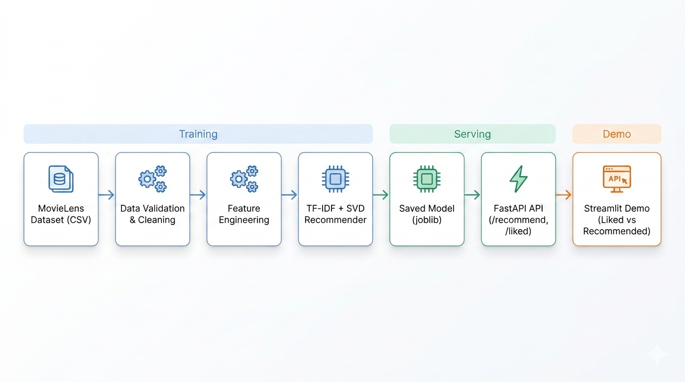
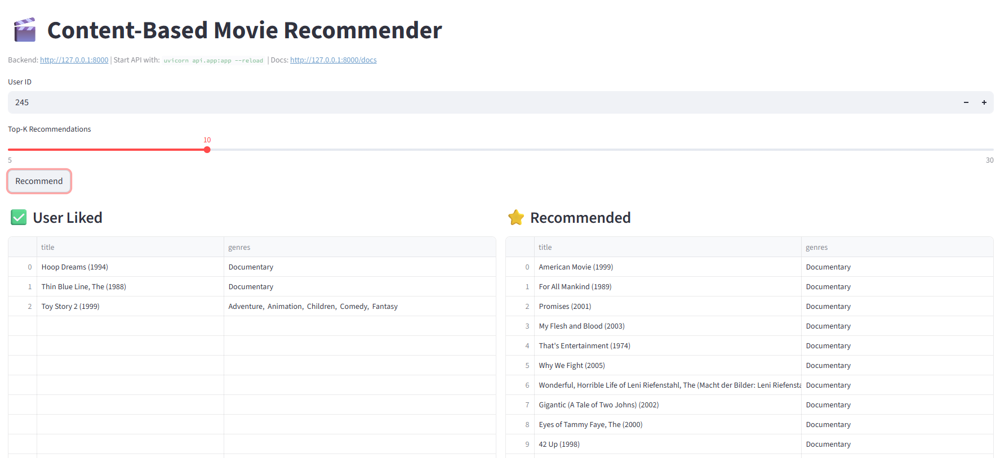

# 🎬 Content-Based Movie Recommender


A production-style **content-based recommendation system** built using **TF-IDF + dimensionality reduction (SVD)**.  
The project demonstrates the full ML workflow:

- Data processing
- Feature engineering
- Model training
- Offline evaluation
- API serving with **FastAPI**
- Interactive demo using **Streamlit**

The system recommends movies based on **user preferences and movie metadata**.

---
## Quick Start
```bash
# 1. Clone and install
pip install -r requirements.txt

# 2. Download MovieLens dataset into datasets/raw/

# 3. Train the model
python -m main.main_train

# 4. Start the API
uvicorn api.app:app --reload

# 5. Launch the demo
streamlit run demo/streamlit_app.py
```
---
# Architecture



The pipeline consists of three main layers:

**Training**
- Data validation & preprocessing
- Feature engineering using movie metadata
- TF-IDF vectorization
- Dimensionality reduction with SVD
- Model serialization with `joblib`

**Serving**
- FastAPI inference service
- `/recommend` endpoint for generating recommendations

**Demo**
- Streamlit UI showing:
  - Movies the user liked
  - Recommended movies

---

## Dataset

The project uses the **[MovieLens dataset](https://grouplens.org/datasets/movielens/)** provided by GroupLens Research.

The dataset is **not included in this repository**. To run the project, download it manually and place the files in `datasets/raw/`:

```
datasets/
└── raw/
    ├── movies.csv
    ├── ratings.csv
    └── tags.csv
```

**Download:** https://grouplens.org/datasets/movielens/latest/

> The project was developed and tested with the **MovieLens Latest Small** dataset (~100k ratings, 9k movies).

| File | Description |
|---|---|
| `movies.csv` | Movie metadata — movieId, title, genres |
| `ratings.csv` | User ratings — userId, movieId, rating, timestamp |
| `tags.csv` | User-generated tags — userId, movieId, tag, timestamp |

---

## Project Structure
```
ml-recommender/
├── configurations/
│   ├── config.py
│   └── logging_config.py
│
├── data/
│   ├── preparation.py
│   ├── validation.py
│   └── featurization.py
│
├── modeling/
│   ├── recommender.py
│   ├── evaluation.py
│   └── models/
│
├── main/
│   └── main_train.py
│
├── api/
│   └── app.py
│
├── demo/
│   └── streamlit_app.py
│
├── utils/
│   └── data_utils.py
│
├── datasets/
│   └── raw/
│
├── docs/
│   ├── architecture_recommender.png
│   └── demo.png
│
├── eda_analysis/
│   ├── eda_analysis.ipynb
│   └── eda_functions.py
│
├── docker/
│   └── Dockerfile
│
├── kubernetes/
│   └── job.yaml
│
├── reports/
│   └── project.log
│
├── tests/
│
├── .gitignore
├── .dockerignore
└── README.md
```

---

# Model

The recommender is **content-based**.

### Feature Pipeline

1. Extract movie metadata (title, genres, tags)
2. Combine metadata into a single text feature
3. TF-IDF vectorization
4. Dimensionality reduction using SVD
5. Cosine similarity to generate recommendations

---

## 🏋️ Training & Evaluation Pipeline

Run the training pipeline:
```bash
python -m main.main_train
```

The script performs the following steps:

| Step | Description |
|------|-------------|
| 📥 Load | Fetch the MovieLens dataset |
| ✅ Validate | Clean and validate the data |
| 🏷️ Feature Engineering | Build a combined text feature (`title + genres + tags`) |
| 🧠 Train | Fit TF-IDF + SVD item vectors |
| 👤 Profile | Build user preference profiles |
| 💾 Save | Persist the trained recommender model |
| 📊 Evaluate | Run leave-one-out evaluation inline |

---

### 📦 Output Model

The trained model is saved to:
```
modeling/models/recommender_model.joblib
```

---

## 📊 Evaluation

After training completes, the pipeline runs a **leave-one-out evaluation** inline to estimate recommendation quality.

### Metrics

| Metric | Description |
|--------|-------------|
| `HitRate@K` | How often the held-out liked movie appears in Top-K recommendations |
| `Coverage@K` | Diversity of recommended items across all users |

### 📋 Example Output
```
HitRate@10: 0.00  (evaluated on 300 users)
Coverage@10: 0.38
```

> **Note:** Content-based recommenders may show low HitRate in leave-one-out tests
> because recommendations rely on **semantic similarity** rather than reproducing exact user history.

## 🚀 Serving the Model (FastAPI)

Start the API locally:
```bash
uvicorn api.app:app --reload --host 127.0.0.1 --port 8000
```

Once running, open the interactive API docs at:
```
http://127.0.0.1:8000/docs
```

### Endpoints

| Method | Endpoint | Description |
|--------|----------|-------------|
| `GET` | `/` | Health check |
| `GET` | `/recommend?user_id=6&k=10` | Top-K recommendations for a user |
| `GET` | `/liked?user_id=6` | Movies the user liked (based on rating threshold) |

---

## 🎨 Demo (Streamlit)

> ⚠️ FastAPI must be running before launching the demo.

Start the Streamlit UI in a separate terminal:
```bash
streamlit run demo/streamlit_app.py
```

The demo displays **Liked Movies** and **Recommended Movies** side by side for any user.

### 📸 Screenshot



---
## Technologies Used

| Tool | Purpose |
|---|---|
| **Python** | Core language |
| **Polars** | High-performance dataframe operations |
| **Scikit-learn** | TF-IDF vectorization and TruncatedSVD dimensionality reduction |
| **FastAPI** | REST API for serving recommendations |
| **Streamlit** | Interactive demo interface |
| **NumPy** | Numerical computations and vector operations |
| **Joblib** | Model serialization and persistence |
| **Docker** | Containerization for consistent deployment |
| **Kubernetes** | Batch job orchestration for model training |

---

## Future Improvements

Possible extensions of the project:

- **Hybrid recommender** combining content-based filtering with collaborative filtering to leverage both item metadata and user-user similarity
- **Time-aware recommendations** using timestamp features to weight recent ratings more heavily and capture evolving user preferences
- **Online evaluation** through A/B testing to measure real-world recommendation quality beyond offline metrics like HitRate@K
- **Model monitoring and logging** to track recommendation quality, data drift, and cold-start rates over time in production
- **Vector databases** (e.g. Faiss, Qdrant) for scalable approximate nearest-neighbour search, replacing the current in-memory cosine similarity computation
- **Hyperparameter tuning** for TF-IDF and SVD parameters using automated search rather than manual config values
- **User feedback loop** to incorporate explicit feedback (thumbs up/down) for continuous profile refinement

---

## License

This project is licensed under the **MIT License**.